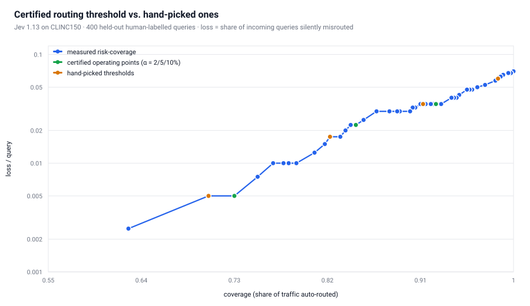
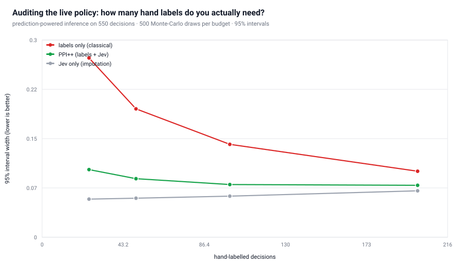
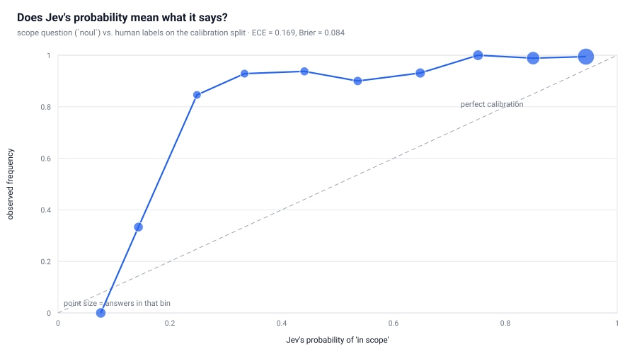
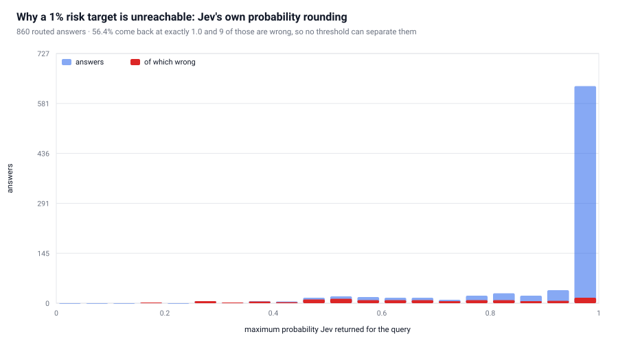
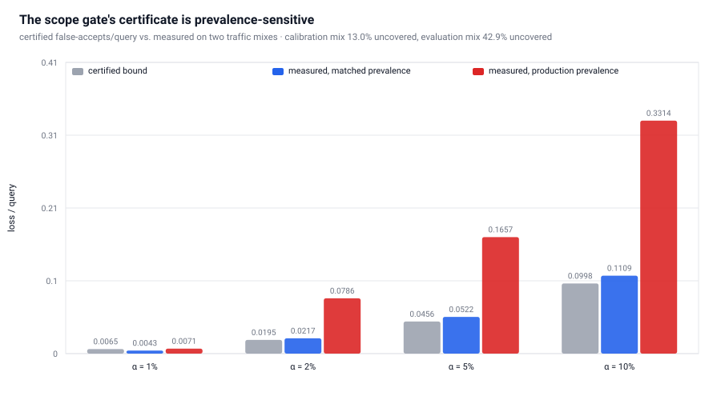
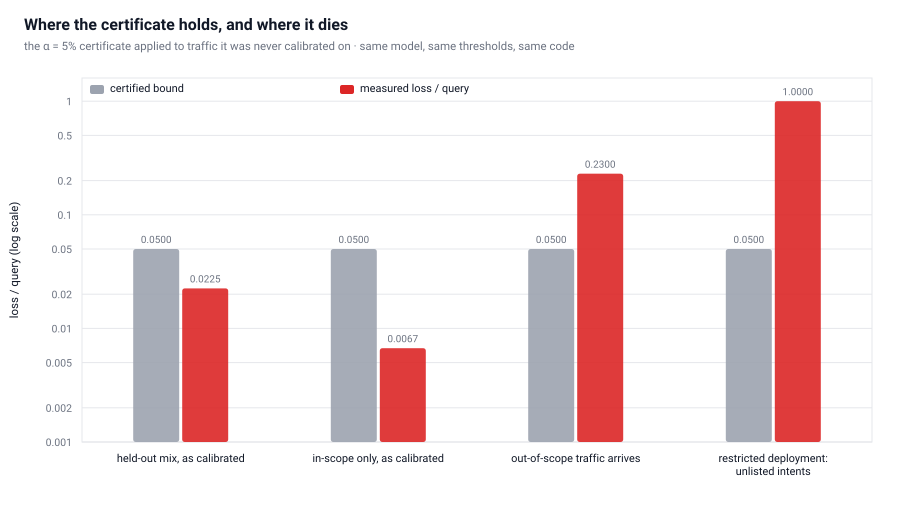

# jev-certify

**Turning Jev's calibrated probabilities into claims that survive an audit.**

[](#quickstart)
[](LICENSE)
[](https://openrouter.ai/typesafe/jev-1.13)
[](#measured-results)

TypeSafe's [Jev](https://docs.typesafe.ai/concepts/system-one) returns calibrated
probabilities, not guarantees. A probability tells you what the model thinks; it does not
tell you what your *system* will do, and a confidence threshold picked by taste has no idea
what its own error rate is. This project adds the missing layer:

1. **A finite-sample certificate.** Split-conformal prediction and conformal risk control
   (Angelopoulos et al., ICLR 2023) turn Jev's `choice`/`noul` answers into a threshold with
   a provable bound on the share of incoming queries that get **silently routed to the wrong
   handler**.
2. **A production audit you can afford.** Prediction-powered inference (Angelopoulos et al.,
   *Science* 2023; PPI++ NeurIPS 2023) checks that bound on live traffic using ~40 hand
   labels instead of ~250, and tells you when the constraint is actually *traffic volume*,
   not labelling budget.
3. **The places it breaks.** Measured, not asserted: distribution shift, prevalence shift,
   and the model's own probability rounding break the guarantee in ways a README normally
   omits.

Built and measured against **Jev 1.13** through the OpenRouter Decisions API
(`POST /api/alpha/decisions` — Jev is not a chat model, and chat-completion SDKs cannot
reach it).

---

## Results at a glance

Every number below is measured on **2,412 journalled Jev decisions costing $0.23 in total**,
against human labels. Nothing is estimated from a model's opinion of itself.

| Question | Answer |
|---|---|
| What does a certified threshold buy? | At a **5% risk target**: Jev settles **84.75%** of traffic itself with a **2.65%** error rate among settled queries, and the certificate **holds** on held-out data (measured 0.0225 vs certified 0.0499) |
| Can it do better? | **No.** α = 1% is *infeasible*: Jev returns exactly 1.0 on 56.4% of answers and 9 of those are wrong, so the attainable bound floors out at 1.95% |
| Does the scope gate work? | **Yes, at the right budget.** At a 1% target the `noul` gate passes **82%** of legitimate traffic while accepting only **1.67%** of human out-of-scope queries |
| How many hand labels to audit it? | **40** labels beat what **254** labels achieve with labels alone — a 62% narrower interval |
| When is labelling pointless? | **±2pp precision is unreachable at any budget** on 550 decisions: that limit is served *traffic*, not humans |
| Where does it break? | Prevalence shift (**3.6×** over the certified bound), out-of-scope traffic arriving mid-flight (**0.23** loss/query), and a 20-intent deployment meeting the other 130 intents (**1.0000** loss/query) |
| What does it cost to run? | **$0.1455 per 1,000 queries**, p50 latency **0.37 s**, and **81%** cheaper than escalating everything to an LLM |

---

## Why this isn't another entry on the list

I read all 268 entries in [`v-modal/awesome-jev-tools`](https://github.com/v-modal/awesome-jev-tools)
across its 13 categories. Nothing there does statistics with a *guarantee*:

| Existing project | What it does | What it doesn't |
|---|---|---|
| `jevcal` | fits a per-question threshold to a target accuracy, verifies on a held-out split | no finite-sample coverage guarantee; a held-out check is an estimate, not a bound |
| `jev-ood-calibration` | measures ECE against a noise floor, refits temperature | measures calibration, offers no operating point |
| `huncho` | thresholds with hysteresis, journals answers, reports Brier | reporting, not certification |
| `jev-router`, `pi-jev-router`, `jcm-router` | pick the cheapest capable model | no risk target, and no measurement of the resulting error rate |

Conformal prediction and prediction-powered inference appear **nowhere** in the list — not in
*Calibration & Research* (17 entries), not in *Evaluation & Benchmarking* (13). That is the
gap this fills.

---

## The task and the request

**CLINC150** (Larson et al., EMNLP 2019): 150 intents, 4,500 human-labelled in-scope
queries, and **1,000 human-written out-of-scope queries**. Ground truth is human, so nothing
is graded by the model being graded.

Each query is **one Jev call carrying two independent typed questions** — the documented
System One pattern, where your code owns the workflow and Jev only answers:

```json
{
  "state": {
    "query": "i want to freeze my bank account",
    "deployed_intents": ["freeze_account", "card_declined", "..."]
  },
  "questions": {
    "intent": {
      "type": "choice",
      "instructions": {"question": "Which single deployed intent does `query` belong to?"},
      "criteria": {"freeze_account": "freeze an account", "card_declined": "card declined", "...": "..."}
    },
    "in_scope": {
      "type": "noul",
      "instructions": {"question": "Does one of the intents in `deployed_intents` cover `query`?"}
    }
  }
}
```

The `choice` picks the handler; the `noul` decides whether the deployed taxonomy covers the
query at all. Every threshold and every action lives in the calling code.

---

## 1. The routing certificate

Loss = `1{auto-routed} × 1{wrong}` — a bound on **expected silently misrouted queries per
incoming request**, which is the number that matters operationally.

| Target α | Threshold λ | Certified loss/query | Auto-routed | Error when routed | Measured loss/query | Certificate held? |
|---|---|---|---|---|---|---|
| 1% | *infeasible* | — | — | — | — | — |
| 2% | 0.971 | 0.0195 | 73.00% | 0.68% | 0.0050 | yes |
| **5%** | **0.831** | **0.0499** | **84.75%** | **2.65%** | **0.0225** | **yes** |
| 10% | 0.657 | 0.0998 | 92.50% | 3.78% | 0.0350 | yes |

460 calibration queries, 400 held out. Jev's top-1 routing accuracy is **93.0%**.



The blue curve is the whole trade-off; the green points are what the certificate selected.
Both sit on the same curve — the certificate is not beating the curve, it is telling you
*where on it you are allowed to stand* for a risk target you chose.

## 2. The scope guardrail

| Target α | Threshold on `noul` | Certified false-accepts/query | In-scope passed | Human out-of-scope accepted | Held? |
|---|---|---|---|---|---|
| **1%** | **0.671** | **0.0065** | **82.00%** | **1.67%** | **yes** |
| 5% | 0.111 | 0.0456 | 99.25% | 38.67% | no — see Finding 3 |

At a 1% budget the gate passes 82% of legitimate traffic while letting 1.67% of the human
out-of-scope set through. That half is a genuinely strong result, and it is the part that
makes a 150-way router deployable at all.

## 3. Auditing the live policy with few labels

550 decisions, `f` = Jev's own estimate that the certified policy answered a query
correctly, `y` = the human label, 500 Monte-Carlo repeats per budget:



| Hand labels | PPI++ width | Labels-only width | Narrower by | Labels saved | PPI++ CI coverage | PPI++ bias |
|---|---|---|---|---|---|---|
| 25 | 0.1017 | 0.2696 | 62.3% | 7.0× | 0.966 | +0.0028 |
| 50 | 0.0880 | 0.1931 | 54.4% | 4.8× | 0.996 | +0.0002 |
| 100 | 0.0792 | 0.1397 | 43.3% | 3.1× | 0.994 | −0.0003 |
| 200 | 0.0781 | 0.0992 | 21.3% | 1.6× | 0.998 | +0.0007 |

| Target 95% half-width | Labels needed (labels only) | Labels needed (PPI++) |
|---|---|---|
| ±0.05 | 254 | **40** |
| ±0.02 | ∞ | ∞ |
| ±0.01 | ∞ | ∞ |

The `∞` rows are the most useful output of the audit section: with only 550 decisions
served, the interval cannot be pushed to ±2pp at any labelling budget, because the
`λ²Var(f)/N` term is set by **how much traffic the policy has served**. Past ~100 labels you
need more traffic, not more humans.

## 4. Reliability of the probabilities themselves



The gate's `noul` probability is directionally right but over-optimistic in the middle of the
range (ECE = 0.169, Brier = 0.084); the router's top probability is better (ECE = 0.099,
Brier = 0.106). This is *why* the certificate matters: the raw probability is not the risk,
so somewhere between the model's number and your deployment decision there has to be a step
with a guarantee attached.

## 5. Cost

| Configuration | Threshold | Auto-routed | Loss/query | Certified | Cost / 1k queries |
|---|---|---|---|---|---|
| certified α = 5% | 0.831 | 84.75% | 0.0225 | 0.0499 | **$0.79** |
| hand-picked 0.9 | 0.900 | 82.25% | 0.0175 | — | $0.89 |
| hand-picked 0.99 | 0.990 | 70.50% | 0.0050 | — | $1.38 |
| saturated 0.999 (uncertified) | 0.999 | 62.75% | 0.0025 | — | $1.71 |
| always send to the LLM | — | 100% | *not measured* | — | $4.20 |

Jev's own cost, latency and token counts are measured from the provider's usage records:
**$0.1455 per 1,000 queries**, p50 **0.37 s**, p95 **0.744 s**, 3,464 input tokens per
decision on average. The only assumed constant is the $4.20/1k escalation price; the
always-LLM row's *accuracy* is deliberately left blank because this study never measured the
fallback model — compare that row on price, not quality.

Read the first four rows together, because they are the whole argument. A team that dials the
threshold up by hand until it feels safe reaches 70.5% coverage at $1.38/1k; the certificate
reaches **84.75%** coverage at **$0.79/1k**, with a bound attached. The certificate did not
just produce a number here — it produced a better operating point than the hand-picked
alternative, and it can say so *before* you ship.

---

## The findings worth the trip

**1. The certificate's resolution floor is the model's rounding, not the maths.**



Jev returns a top probability of **exactly 1.0 on 56.4% of answers**, and 9 of those were
wrong. No threshold separates a wrong 1.0 from a right 1.0, so on 460 calibration queries the
attainable bound floors out at **1.95% per query** and α = 1% is unreachable — no cleverer
threshold helps. Across 860 answers Jev returned only **94 distinct** top-probabilities, of
which 60 were multiples of 0.01, and never below 0.15. Anyone tightening α on this model will
hit this wall; it is a property of Jev 1.13's output, and it is why §1's table has a hole at
the top.

**2. Conformal prediction sets are useless on a 150-way router.** APS averages **148.5
labels** at 99.75% coverage; the margin score averages **150.0 of 150**. With a peaked
distribution over a large label space, guaranteeing the truth is in the set means admitting
the whole taxonomy. Set-valued prediction earns its keep on small label spaces or over
retrieval shortlists. Measured, kept in the report, and dropped — which is worth more than
never having tried it.

**3. The gate's per-query certificate is prevalence-sensitive.**



The gate's loss counts one failure per *incoming query*, so it scales with how much traffic
the taxonomy fails to cover. Calibrated on a mix that was 13.0% uncovered and evaluated on one
that was 42.9% uncovered, the 5% certificate missed by **3.6×** (0.1657 measured). Re-scoring
the same thresholds on a prevalence-matched mix isolates it. Prevalence is a first-class
input, and the fix is the caller's job: calibrate on a mix that matches production, or certify
the conditional rate and multiply by monitored prevalence.

**4. A certificate says nothing about traffic it wasn't calibrated on.**



A second deployment with only 20 intents, calibrated on its own taxonomy, is told **"route
everything"** (certified 1.75% per query) and measures 3.5% on its own traffic — the
certificate holds. Then real traffic arrives carrying the other 130 intents: **loss/query =
1.0000, certificate catastrophically broken.** Same model, same code, same α. Its scope gate
could not be calibrated at all, because its calibration pool contained no uncovered traffic to
learn from. That is a deployment hazard no statistical method fixes, and it is the section a
router's README usually omits.

**5. PPI's limit is traffic, not labels.** Doubling the hand-labelling budget from 100 to 200
labels bought a 1.4% narrower interval. The pool term dominates. "How many labels do I need?"
has a real answer here: ±5pp needs 40, ±2pp needs an impossible number, and the project tells
you which.

---

## Quickstart

```bash
pip install -e .                        # stdlib only -- no numpy, no SDK, urllib is the whole HTTP stack
cp .env.example .env                    # put OPENROUTER_API_KEY in it

# 1. Analyse the shipped run. Zero API calls, zero cost, every figure regenerated:
python -m experiments.analyse           # -> results/results.json, results/REPORT.md,
                                        #    report/dashboard.html, docs/*.svg

# 2. Interrogate the certificate without re-billing:
jev-certify status                      # journal size, token counts, cost, latency
jev-certify certify --alpha 0.05        # fit and print the certificates
jev-certify audit --labels 40           # prediction-powered audit at a budget

# 3. Check the maths (statistical assertions, not shape checks; no API calls):
python -m pytest tests -q               # 43 tests

# 4. Spend real calls -- the only step that costs money (~$0.35 for 2,412 decisions):
python -m experiments.collect --workers 8
```

`JevClient(offline=True)` can only answer from the journal and refuses to make a request, so a
test that passes offline proves the replay path works.

## Reproducing every number

The committed `results/journal.jsonl` carries the **answers, usage and latency for all 2,412
requests**. The request payloads are not stored — they are rebuilt deterministically from
`results/plan-v1-*.json` by `jev_certify.tasks`, and each rebuild is hashed and checked against
the journal's content-addressed key before its answer is used. A wrong rebuild raises
`KeyError` instead of silently analysing the wrong question, which is why the slim journal
(4.5 MB instead of 15.9 MB) proves as much as the full one. Regenerate the full form with
`jev-certify pack-journal`, or re-run the collection, which answers from the journal and
spends nothing:

```json
{"api_calls": 0, "journal_hits": 2410, "cost_usd": 0.0, "journal_total_cost_usd": 0.229461}
```

CLINC150 itself is not vendored (research-use dataset); `experiments/collect.py` fetches it to
`data/` on first use. The exact query texts used are in the committed plan files.

## How it's built

```
jev_certify/
  client.py       Decisions-API client: content-addressed journal, retries, concurrency
  conformal.py    conformal_quantile, prediction_set (APS/LAC), certified_threshold (CRC),
                  selective_report, Clopper-Pearson and Wilson bounds, risk-coverage curves
  ppi.py          PPI++, classical and imputation estimators, audit simulation, sample
                  planning, ECE / Brier / reliability bins
  cascade.py      cost model: certified vs hand-picked vs always-escalate
  tasks.py        CLINC150 pools + the two-question request builder
  analysis.py     every measurement in this README, as library code
  report.py       renders REPORT.md and the dependency-free HTML dashboard
  viz.py          renders docs/*.svg -- charts with no plotting dependency
  cli.py          status / certify / audit / report / pack-journal (none can spend money)
experiments/
  collect.py      the only script that calls the API
  analyse.py      journal + pools -> results, report, dashboard, figures (zero API calls)
tests/            43 tests: coverage promises, PPI validity, cost algebra, journal replay,
                  and README numbers pinned to results.json
docs/*.svg        the figures above, generated by viz.py
results/          the recorded run: journal, plan, results.json, REPORT.md
```

**Design decisions that matter**

- **Every request is content-addressed** (`sha256(model, state, questions)`). Re-running the
  collection after a crash served **2,410 of 2,412 requests from the journal at $0.00** —
  verified, not claimed. Analysis never re-bills.
- **Fail-soft collection.** One transient HTTP 520 killed a 2,400-decision run; the client now
  collects per-request failures and retries only the gaps, so a long run can't be lost to one
  bad request.
- **The tests assert the promises statistically.** Conformal coverage, CRC's risk bound and
  PPI's interval coverage are checked by simulating exchangeable data hundreds of times. A
  wrong quantile would pass a shape check — it fails these.
- **Reports are generated only from the results dict**, and `tests/test_readme_numbers.py`
  pins the README's headline numbers to `results/results.json`, so the prose cannot drift from
  the data that produced it.
- **Charts are generated, never drawn by hand.** `jev_certify/viz.py` builds SVG from the same
  results dict, so a figure cannot show a number the analysis did not measure.
- **Negative results stay in.** The prediction-set and prevalence sections are failures that
  were measured, kept, and explained.

---

## Limits

- **Exchangeability is the assumption, and it is not free.** Finding 4 measures it breaking; a
  guarantee is only ever about the population it was calibrated on.
- **The routing certificate is per-query, not per-routed-query.** It bounds silently misrouted
  traffic, not the error rate among routed queries. Both columns are reported because teams ask
  for different ones.
- **Sample size sets the resolution floor** (≈1/(n+1), plus the model's rounding in Finding 1).
  More calibration traffic buys a tighter certificate, not a better model.
- **CLINC150 is a research test set, not your traffic.** The method transfers; the numbers are
  this dataset's.
- **Both questions share one request.** They are evaluated independently, but the gate's
  accuracy is not independent evidence about the router's.
- **Not yet built:** a drift monitor that re-certifies when the traffic mix moves, and a
  per-question `choice` version of the certificate for hierarchical taxonomies.

## References

- Angelopoulos, Bates, Fisch, Lei & Schuster. *Conformal Risk Control.* ICLR 2023 (arXiv:2208.02814).
- Angelopoulos, Bates, Fannjiang, Jordan & Zrnic. *Prediction-Powered Inference.* Science 382:669–674, 2023.
- Angelopoulos et al. *PPI++: Efficient Prediction-Powered Inference.* NeurIPS 2023 (arXiv:2311.01453).
- Romano, Sesia & Candès. *Classification with Valid and Adaptive Coverage.* NeurIPS 2020 (arXiv:2006.02544).
- Sadinle, Lei & Wasserman. *Least Ambiguous Set-Valued Classifiers with Bounded Error Levels.* JASA 2019.
- Geifman & El-Yaniv. *Selective Classification for Deep Neural Networks.* NeurIPS 2017.
- Guo, Pleiss, Sun & Weinberger. *On Calibration of Modern Neural Networks.* ICML 2017.
- Larson et al. *An Evaluation Dataset for Intent Classification and Out-of-Scope Prediction.* EMNLP 2019.
- TypeSafe AI. *System One*, *Confidence*, *Intent routing* (docs.typesafe.ai).
- OpenRouter. *Jev 1.13* model page and Decisions API (openrouter.ai/typesafe/jev-1.13).

## License

MIT — see [LICENSE](LICENSE).

If you build on this, the interesting next step is a drift monitor that re-certifies when the
traffic mix moves. The failure mode in Finding 4 is left unsolved on purpose.
